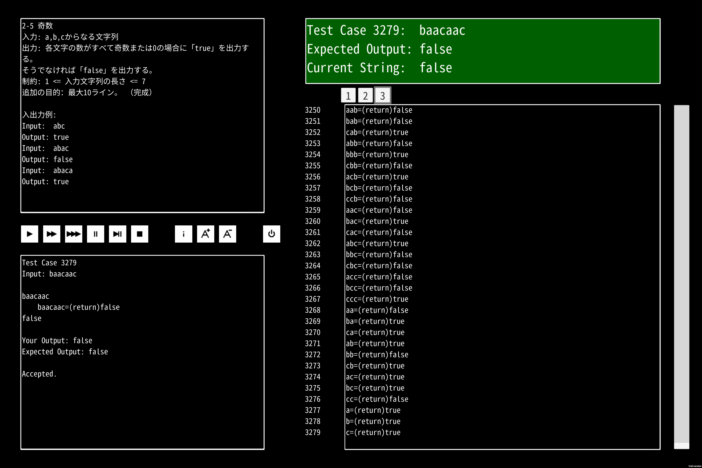

# これなに

オータムセールで買ったA=Bのチートです。

# A=Bってなに

構文が一つしかないプログラミング言語を学生が作ったという設定のパズルゲームです。

- A=Bは文字列中にAにマッチする部分がある限り、AをBに置換することを繰り返すという意味で、
- A=(return)Bは文字列中にAにマッチする部分がある場合、Bを出力するという意味です。
- EOLは操作が繰り返された結果の文字列そのものを出力するという意味です。

（なので厳密には構文が3つあるように思えます）

例えば全ての文字種の数が奇数もしくは0のときtrueを、そうでない場合はfalseを出力せよという問題の場合、以下のようなコードが例として考えられます。

```a=b
//=sort
ca=ac
cb=bc
ba=ab

//=mod 2
aaa=a
bbb=b
ccc=c

//=is_even
aa=(return)false
bb=(return)false
cc=(return)false

//=case of odd
=(return)true
```

# チートってなに

A=Bの問題は最悪でも以下のようなInputの制約を持ちます。

- 文字列の種類がABCの3つ
- 文字列の長さが1以上7以下

これは3279通りなので全列挙が可能です。

長さ7の場合も同様に3279行を記述すればクリア扱いになります。

# クリア例の画像

最短10行のところを3279行で解くことができました、やったー！



# トロコン

ところで、A=Bでは最短の行数でクリアすると実績を獲得できます。

やりこみ要素としてのコードゴルフというわけです。

なんだか作者から挑戦状を叩きつけられた気がしてきますね？（被害妄想の可能性あります）

そういう訳でコードゴルフをしました。

文字列の最大長と解法を表す関数fを引数にとって全列挙解法のコードを返します。

```jl
solve(f, n=7) = join(["$(i)=(return)$(f(i))\n" for i in vcat([(f -> (x->f((y,z)->((x(x))(y,z))))(x->f((y,z)->((x(x))(y,z)))))(f -> (n, memo::Dict{Int, Vector{String}}=Dict(0=>[""])) -> haskey(memo, n) ? memo[n] : (memo[n] = vcat([[s*c for s in f(n-1, memo)] for c in 'a':'c']...)))(i) for i in n:-1:1]...)])
```

# ちょっとした解説

## 長さnのABCからなる文字列を列挙する関数

長さn-1の文字列にA,B,Cをくっつけて生成しているので再帰関数にしました。

3股の再帰なのでメモ化しています。

メモのデフォルト値として終了条件を指定しています。

```jl
(f -> (n, memo::Dict{Int, Vector{String}}=Dict(0=>[""])) -> haskey(memo, n) ? memo[n] : (memo[n] = vcat([[s*c for s in f(n-1, memo)] for c in 'a':'c']...)))
          ^^^^^^^^^^^^^^^^^^^^^^^^^^^^^^^^^^^^^^^^^^^^^                                                                       ^^^^
          メモ化再帰のための引数と終了条件としてのデフォルト値
```

## Yコンビネータ

一行に関数を組み込もうとすると無名関数にする必要があり、無名関数で再帰関数は普通はできないです。

呼び出す"自分"に名前がついていないからです。

そこで無名関数が自分自身を参照することを可能にする高階関数、Yコンビネータを無名再帰に作用させることで実現しています。

```jl
(f -> (x->f((y,z)->((x(x))(y,z))))(x->f((y,z)->((x(x))(y,z)))))
```

## ここまでのごちゃごちゃを整理すると

```jl
solve(f, n=7) = join(["$(i)=(return)$(f(i))\n" for i in vcat([abcでできたi文字の文字列を作る関数(i) for i in n:-1:1]...)])
                                                        ^^^^^^^^^^^^^^^^^^^^^^^^^^^^^^^^^^^^^^^^^^^^^^^^^^^^^^^^^^^^^
                                                        abcでできたn文字以下の文字列の配列
```

# 感想

パズルゲームのズルでパズルゲームをした気がします。してやられました……

どうでもいいですがサム・アルトマンさんってYコンビネータ（会社）の元代表らしいですね、

最近聞いた名前が出てきてタイムリーでした。
